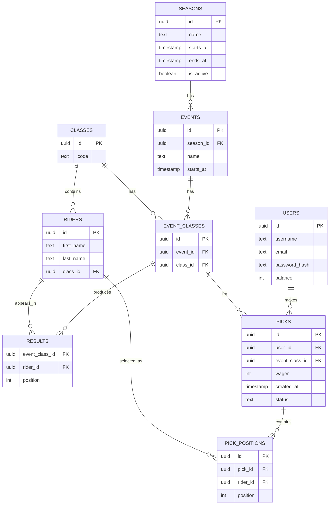

# GateDrop

**GateDrop** is a fantasy Supercross (SX) and Motocross (MX) betting application.

Users place wagers on race outcomes by predicting the **top 5 riders** in each class (250 / 450) for every event in a season.

> Goal: simple, fast, weekly picks with scoring based on race results.

---

## Core Concept

For each event:

- Users create a **pick entry**
- Each pick contains **5 ranked rider selections**
- Users place a **wager**
- Scores or payouts are calculated from actual race results

> TODO: Define the exact scoring / payout algorithm.

---

## Architecture

GateDrop is split into 3 main components:

- **API Layer** → Go
- **Results Fetcher** → Python (scrapes race results from SXLive)
- **Frontend** → React (TypeScript)

---

## Data Model

This version of the schema stores rider selections in a separate `pick_positions` table instead of `first_rider_id`, `second_rider_id`, etc.

That makes the data model easier to query, easier to score, and more flexible if the number of pick slots ever changes.



---

## Key Constraints

```sql
UNIQUE(event_id, class_id)                     -- EVENT_CLASSES
UNIQUE(event_class_id, position)              -- RESULTS
UNIQUE(event_class_id, rider_id)              -- RESULTS
UNIQUE(user_id, event_class_id)               -- PICKS
UNIQUE(pick_id, position)                     -- PICK_POSITIONS
UNIQUE(pick_id, rider_id)                     -- PICK_POSITIONS
CHECK(position BETWEEN 1 AND 5)               -- PICK_POSITIONS
```

## Example Data

A cleaner way to express example data is to show it as small related records instead of embedding example values inside the schema diagram.

### Season

```json
{
  "id": "season_2026_sx",
  "name": "Supercross 2026",
  "starts_at": "2026-01-01",
  "ends_at": "2026-07-01",
  "is_active": true
}
```

### Event

```json
{
  "id": "event_daytona_2026",
  "season_id": "season_2026_sx",
  "name": "Daytona",
  "starts_at": "2026-03-05"
}
```

### Class

```json
{
  "id": "class_450",
  "code": "450"
}
```

### Rider

```json
{
  "id": "rider_jett_lawrence",
  "first_name": "Jett",
  "last_name": "Lawrence",
  "class_id": "class_450"
}
```

### Event Class

```json
{
  "id": "event_daytona_450",
  "event_id": "event_daytona_2026",
  "class_id": "class_450"
}
```

### Results

```json
[
  {
    "event_class_id": "event_daytona_450",
    "rider_id": "rider_jett_lawrence",
    "position": 1
  }
]
```

### User

```json
{
  "id": "user_boba",
  "username": "boba",
  "email": "boba@fett.com",
  "balance": 500
}
```

### Pick

```json
{
  "id": "pick_1",
  "user_id": "user_boba",
  "event_class_id": "event_daytona_450",
  "wager": 200,
  "created_at": "2026-03-01T10:00:00Z"
  "status": "complete"
}
```

### Pick Positions

```json
[
  {
    "id": "pick_pos_1",
    "pick_id": "pick_1",
    "rider_id": "rider_jett_lawrence",
    "position": 1
  },
  {
    "id": "pick_pos_2",
    "pick_id": "pick_1",
    "rider_id": "rider_rider2",
    "position": 2
  },
  {
    "id": "pick_pos_3",
    "pick_id": "pick_1",
    "rider_id": "rider_rider3",
    "position": 3
  },
  {
    "id": "pick_pos_4",
    "pick_id": "pick_1",
    "rider_id": "rider_rider4",
    "position": 4
  },
  {
    "id": "pick_pos_5",
    "pick_id": "pick_1",
    "rider_id": "rider_rider5",
    "position": 5
  }
]
```

---

## Suggested Table Definitions

This is one possible SQL shape for the updated picks schema:

```sql
CREATE TABLE picks (
  id UUID PRIMARY KEY,
  user_id UUID NOT NULL REFERENCES users(id),
  event_class_id UUID NOT NULL REFERENCES event_classes(id),
  wager INT NOT NULL,
  created_at TIMESTAMP NOT NULL DEFAULT NOW(),
  UNIQUE(user_id, event_class_id)
);

CREATE TABLE pick_positions (
  id UUID PRIMARY KEY,
  pick_id UUID NOT NULL REFERENCES picks(id) ON DELETE CASCADE,
  rider_id UUID NOT NULL REFERENCES riders(id),
  position INT NOT NULL,
  UNIQUE(pick_id, position),
  UNIQUE(pick_id, rider_id),
  CHECK (position BETWEEN 1 AND 5)
);
```

---

## Development Notes

### Setup SQLC + Goose

#### Project Structure

```text
internal/database
sql/schema
sql/queries
```

#### sqlc config

```yaml
version: "2"
sql:
  - schema: "sql/schema"
    queries: "sql/queries"
    engine: "postgresql"
    gen:
      go:
        out: "internal/database"
```

#### Install tools

```bash
go install github.com/pressly/goose/v3/cmd/goose@latest
brew install sqlc
```

#### Create migration

```bash
goose -dir ./sql/schema create add_users_table sql
```

### Run Migration

```bash
goose -dir sql/schema postgres "postgres://joshuahartwig:@localhost:5432/chirpy" up
```

---

## Notes

###

Create JWT Secret

```bash
openssl rand -base64 32
```

### Querying picks becomes easier

You can fetch one pick and all ranked rider selections like this conceptually:

```sql
SELECT
  p.id AS pick_id,
  p.user_id,
  p.event_class_id,
  p.wager,
  pp.position,
  r.first_name,
  r.last_name
FROM picks p
JOIN pick_positions pp ON pp.pick_id = p.id
JOIN riders r ON r.id = pp.rider_id
WHERE p.id = $1
ORDER BY pp.position;
```
